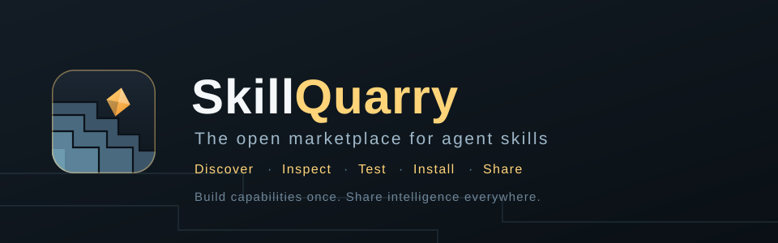
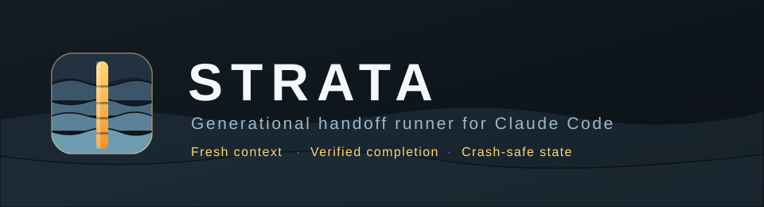
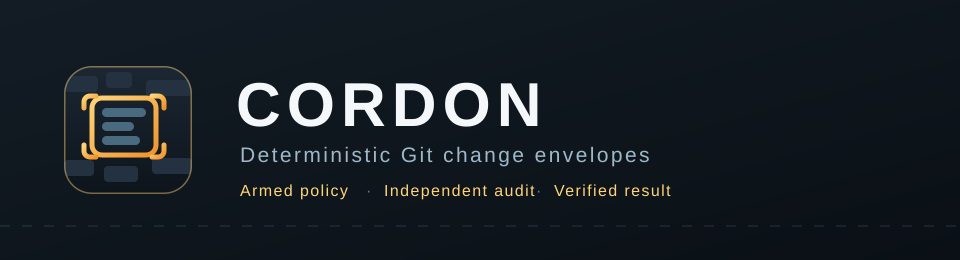
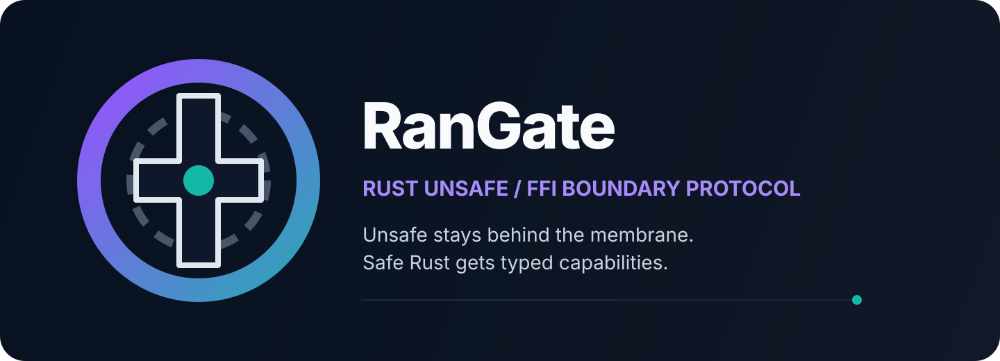

<div align="center">



<br>
<br>

<!-- SKILLS:STATS:START -->


<!-- SKILLS:STATS:END -->

<br>

<!-- SKILLS:CI:START -->
[](https://github.com/BEKO2210/SkillQuarry/actions/workflows/strata-tests.yml)
[](https://github.com/BEKO2210/SkillQuarry/actions/workflows/cordon-tests.yml)
[](https://github.com/BEKO2210/SkillQuarry/actions/workflows/rangate-tests.yml)
<!-- SKILLS:CI:END -->
[](https://github.com/BEKO2210/SkillQuarry/actions/workflows/readme.yml)
[](LICENSE)
[](https://github.com/BEKO2210/SkillQuarry/stargazers)
[](https://github.com/BEKO2210/SkillQuarry/commits/main)

<br>

[**Skills**](#skills) ·
[**Overview**](#overview) ·
[**Skill Standard**](docs/SKILL-SPEC.md) ·
[**Security**](#security) ·
[**Contributing**](CONTRIBUTING.md) ·
[**Roadmap**](#roadmap)

<br>

**Discover, build, test, share, and install reusable capabilities for AI coding agents.**

</div>

---

## Overview

**SkillQuarry** is an open-source ecosystem and future marketplace for reusable AI-agent skills.

Modern coding agents are powerful, but many of their best capabilities are still trapped inside:

- giant prompts
- private configuration files
- shell scripts
- hooks
- isolated repositories
- undocumented workflows
- one-off automation systems

SkillQuarry aims to turn those capabilities into reusable building blocks that can be:

**discovered, inspected, tested, versioned, installed, shared, and composed.**

A SkillQuarry skill can teach an agent how to:

- debug software
- review pull requests
- perform security audits
- improve UI and UX
- run and diagnose tests
- manage releases
- optimize context usage
- automate repository workflows
- recover from interrupted work
- generate documentation
- orchestrate autonomous coding loops
- coordinate specialized agents
- perform DevOps workflows
- handle mobile development tasks

The goal is simple:

> **Stop rebuilding useful agent behavior from scratch.**

---

## Why SkillQuarry?

Software has package managers.

Developers have npm, Cargo, PyPI, Maven, Homebrew, and countless other ecosystems for sharing reusable functionality.

AI agents need something similar for **capabilities**.

SkillQuarry is designed around that idea.

Instead of copying a 500-line prompt from one project into another, a reusable capability should eventually be installable like a package.

```bash
skillquarry search security
skillquarry install repository-auditor
skillquarry update
```

These CLI commands represent the planned SkillQuarry experience and are not yet guaranteed to be implemented.

---

## Core Principles

### Open

Skills should be inspectable whenever possible.

### Vendor-neutral

SkillQuarry should not depend on a single AI provider.

### Portable

A capability should be reusable across projects.

### Testable

Agent behavior should be validated instead of trusted blindly.

### Versioned

Changes to skills should be traceable.

### Composable

Small specialized skills should be able to work together.

### Secure

Permissions and executable behavior should be transparent.

### Fail-safe

Autonomous workflows should prefer stopping safely over destructive guessing.

---

## Agent Ecosystem

SkillQuarry is intended to support adapters and skills for multiple agent environments.

<div align="center">


</div>

Individual skills may support only a subset of these environments.

Compatibility labels describe technical targets only and do not imply affiliation or endorsement.

---

# Skill Marketplace

SkillQuarry is intended to become a searchable marketplace for agent capabilities.

## Available now

<!-- SKILLS:TABLE:START -->
| Skill | Category | What it does | Agents | Quality |
|---|---|---|---|---|
| **[Strata](skills/autonomous/strata)** | 🤖 Autonomous agents | Generational handoff runner: executes a long coding task as a chain of fresh Claude Code processes that pass a validated, compacted handoff forward, with independent verification of completion and crash-safe state. | Claude Code |  [100 tests, 100% core coverage](skills/autonomous/strata/TEST_REPORT.md) |
| **[Cordon](skills/security/cordon)** | 🔐 Security | Deterministic Git change envelopes for coding agents: constrain Git-visible paths and change budgets, reject HEAD movement by default, and let independent verifier commands overrule an agent's success claim. | Claude Code, Any agent (manual mode) |  [64 tests, 100% core coverage](skills/security/cordon/TEST_REPORT.md) |
| **[RanGate](skills/security/rangate)** | 🔐 Security | Compiler-driven Rust unsafe/FFI boundary protocol: concentrate raw-pointer, ownership, lifetime and thread-safety invariants behind the smallest safe typed membrane, then attack it with independent compiler, doctest, release and Miri checks. | Claude Code |  [14 tests, N/A — protocol skill; the Rust fixture is exercised in debug, compile-fail (reason-checked), release and Miri jobs](skills/security/rangate/TEST_REPORT.md) |
<!-- SKILLS:TABLE:END -->

## Planned categories

| Category | Examples |
|---|---|
| 🧠 Agent Intelligence | Planning, context management, handoffs |
| 💻 Coding | Debugging, refactoring, migrations |
| 🧪 Testing | Unit, integration, E2E, regression |
| 🔐 Security | Auditing, hardening, dependency analysis |
| 🎨 UI / UX | Accessibility, responsive design, design review |
| 📦 DevOps | CI/CD, Docker, deployment, releases |
| 📱 Mobile | Android, iOS, store workflows |
| 🌐 Web | Frontend, backend, APIs, performance |
| 📚 Documentation | README files, architecture, API docs |
| 🤖 Autonomous Agents | Ralph loops, repair agents, orchestration |
| 🔌 Integrations | MCP, hooks, APIs |
| 🛠️ Utilities | Git, repository inspection, automation |

A future marketplace listing could expose information such as:

- name
- description
- version
- author
- license
- supported agents
- operating-system compatibility
- required tools
- permissions
- dependencies
- checksum
- test status
- security status
- source repository
- release history

---

# Skill Standard

The specification is finalized and enforced. The normative text is
**[docs/SKILL-SPEC.md](docs/SKILL-SPEC.md)**; the machine-readable form is
**[registry/schema.json](registry/schema.json)**, checked in CI by
`tools/validate_skills.py`.

A skill lives at `skills/<category>/<name>/`:

```text
skills/<category>/<name>/
├── skill.json        must   manifest; single source of truth for metadata
├── SKILL.md          must   instructions for the agent
├── README.md         must   documentation for a human
├── TEST_REPORT.md    should evidence: environment, results, defects, limits
├── install.sh        should dependency-free installer
├── uninstall.sh      should removes exactly what the installer created
├── src/              should implementation
└── tests/            should automated tests, runnable offline
```

Six manifest fields are required — `name`, `displayName`, `version`,
`description`, `category`, `license` — and everything else is validated when
present. `name` must equal the directory name, `category` must equal the parent
directory, and every file the manifest points at must exist.

The rules that matter most:

- **No third-party runtime dependencies**, and no installer that downloads
  anything. A reviewer must be able to read every line a skill will execute.
- **Declare what you touch.** Any skill that runs commands states its filesystem,
  shell, network and environment reach in `permissions`.
- **Never write to a user's `.gitignore`.** Repository state is hidden through
  `.git/info/exclude`.
- **Tests run offline with one command**, external programs are replaced by a fake
  binary with the same command-line contract, and coverage is gated by a number.
- **Worst cases are calculated, not fuzzed at.** That distinction has already
  caught a real defect here.

## Example manifest

```json
{
  "name": "example-skill",
  "displayName": "Example Skill",
  "version": "1.0.0",
  "description": "A reusable capability that does one clearly described thing.",
  "category": "coding",
  "license": "Apache-2.0",
  "compatibility": ["claude-code"],
  "platforms": ["linux", "macos"],
  "permissions": {
    "filesystem": "reads the repository; writes only its own state directory",
    "shell": "spawns git and the configured verifier commands",
    "network": "none",
    "environment": "none"
  },
  "tests": {
    "command": "python3 tests/run_tests.py --min 100",
    "count": 42,
    "coverage": "100% of core.py executable lines",
    "report": "TEST_REPORT.md"
  },
  "quality": "tested"
}
```

Validate a manifest before opening a pull request:

```bash
python3 tools/validate_skills.py
```

---

# Skills

Everything below this line is generated from the `skill.json` manifests by
`tools/render_readme.py`. Adding a skill means adding its folder — the README and
`registry/skills.json` update themselves in CI.

<!-- SKILLS:CARDS:START -->
### Strata

<div align="center">



</div>

**Every generation is a fresh context. Only a validated core sample crosses the boundary.**

Generational handoff runner: executes a long coding task as a chain of fresh Claude Code processes that pass a validated, compacted handoff forward, with independent verification of completion and crash-safe state.

- Each generation is its own `claude -p` process — context never accumulates.
- Independent `--verify` commands overrule the agent's own completion claim.
- Atomic state: a killed host resumes from the last validated handoff.
- Stall detector, generation ceiling, turn cap and cost ceiling stop runaway loops.

```bash
cd skills/autonomous/strata && ./install.sh

strata start "Fix the repository so lint and build pass without weakening checks." \
  --verify "npm run lint" \
  --verify "npm run build" \
  --max-generations 20 \
  --max-budget-usd 3
```

[Documentation](skills/autonomous/strata/README.md) · [Skill](skills/autonomous/strata/SKILL.md) · [Test report](skills/autonomous/strata/TEST_REPORT.md)

---

### Cordon

<div align="center">



</div>

**Limit the blast radius. Verify the result.**

Deterministic Git change envelopes for coding agents: constrain Git-visible paths and change budgets, reject HEAD movement by default, and let independent verifier commands overrule an agent's success claim.

- Arms an allow/deny path policy plus file, line, byte, binary and commit budgets.
- Audits the Git-visible result independently of anything the agent reports.
- Refuses to arm when index flags would hide a tracked file from the audit.
- Works with any agent in manual mode, or wraps Claude Code end to end.

```bash
cd skills/security/cordon && ./install.sh

cordon run "Fix the parser regression and touch nothing else." \
  --allow "src/parser/**" \
  --allow "tests/parser/**" \
  --verify "python3 -m unittest discover -s tests" \
  --max-files 8 \
  --max-added-lines 400
```

[Documentation](skills/security/cordon/README.md) · [Skill](skills/security/cordon/SKILL.md) · [Test report](skills/security/cordon/TEST_REPORT.md) · [Research](skills/security/cordon/RESEARCH.md)

---

### RanGate

<div align="center">



</div>

**Unsafe stays behind the membrane. Safe Rust gets typed capabilities.**

Compiler-driven Rust unsafe/FFI boundary protocol: concentrate raw-pointer, ownership, lifetime and thread-safety invariants behind the smallest safe typed membrane, then attack it with independent compiler, doctest, release and Miri checks.

- Maps the unsafe blast radius before editing, so the refactor has a measurable baseline.
- Converts raw representation at one boundary instead of exporting pointer validity and ownership obligations to callers.
- Uses compile-fail proofs for ownership, aliasing and thread-transport constraints — invalid safe programs must fail to compile.
- Adds independent stable, release and pinned-nightly Miri verification without installing toolchains at skill runtime.

```bash
cd skills/security/rangate && ./install.sh

# In Claude Code, from the target Rust repository:
/rangate Refactor this unsafe/FFI boundary so raw invariants stop leaking into callers. Prove the result with compiler and test evidence.
```

[Documentation](skills/security/rangate/README.md) · [Skill](skills/security/rangate/SKILL.md) · [Test report](skills/security/rangate/TEST_REPORT.md)
<!-- SKILLS:CARDS:END -->

---

# How generational handoff works

Traditional autonomous agent loops can accumulate increasingly large conversation histories.

Over long-running tasks this may lead to:

- unnecessary context growth
- increased token processing
- stale information
- irrelevant historical context
- repeated mistakes
- difficult crash recovery
- runaway autonomous loops

Strata uses a different architecture.

Each generation performs work, verifies its progress, creates a compact handoff, and then terminates.

The next generation receives a fresh context containing only the information required to continue.

```text
Generation 001
      │
      ├── Work
      ├── Test
      ├── Verify
      │
      └── Compact Handoff
               │
               ▼
        Context terminates
               │
               ▼
        Fresh Generation
               │
               ▼
Generation 002
      │
      ├── Load objective
      ├── Load verified handoff
      ├── Read relevant files
      ├── Continue exact next step
      │
      └── Compact Handoff
               │
               ▼
              ...
```

The guiding principle is:

> **Remember information only when remembering it is cheaper than rediscovering it.**

---

## What the Handoff Contains

Before a generation terminates, it should preserve only information useful to its successor.

Examples include:

- current objective
- verified progress
- modified files
- test results
- important discoveries
- failed approaches
- approaches that should not be repeated
- unresolved problems
- relevant files
- exact next action
- completion criteria

The complete previous conversation does not need to be inherited.

---

## Fresh Context Architecture

A conventional autonomous loop may behave like this:

```text
Run 1
  ↓
Context grows
  ↓
Run 2
  ↓
Context grows
  ↓
Run 3
  ↓
Context grows
  ↓
...
```

A generational architecture behaves differently:

```text
Run 1
  ↓
Handoff
  ↓
Context ends

Run 2
  ↓
Handoff
  ↓
Context ends

Run 3
  ↓
Handoff
  ↓
Context ends
```

The key is not simply clearing context.

The key is creating a **high-quality transition before the context disappears**.

---


## External Verification

Autonomous agents should not be trusted purely because they say a task is complete.

SkillQuarry favors independent verification whenever possible.

```text
Agent reports COMPLETE
          │
          ▼
 Independent verification
          │
      ┌───┴───┐
      │       │
    PASS     FAIL
      │       │
      ▼       ▼
   Finish   Continue
```

For coding tasks, independent verification may include:

- tests
- linting
- builds
- type checking
- static analysis
- security checks
- expected file changes
- custom validation commands

A model's completion statement should never override a failing verification step.

---

# Reliability

Long-running autonomous workflows should be designed for failure.

Potential protections include:

- atomic state writes
- handoff validation
- interrupted-run recovery
- corrupted-state detection
- false-completion protection
- stalled-loop detection
- maximum generation limits
- maximum turn limits
- process timeouts
- token limits
- cost limits
- concurrent-run locks
- bounded context injection
- bounded Git output
- external verification

Safety should be enforced by orchestration whenever possible instead of relying entirely on the model to remember instructions.

---

# Security

Agent skills must be treated as **executable capabilities**, not harmless text.

Depending on their design, a skill may cause an agent to:

- execute shell commands
- modify source files
- inspect repositories
- install packages
- access external APIs
- read environment variables
- perform Git operations
- communicate over a network

Users should inspect third-party skills before execution.

Reporting a vulnerability, the supported scope and the response times are in
**[SECURITY.md](SECURITY.md)**. Never report a security problem in a public issue.

Already in place:

- **explicit permission manifests** — every skill declares its filesystem, shell,
  network and environment reach in `skill.json`, validated against the schema;
- **no third-party runtime dependencies** — the code a skill runs is the code you
  can read;
- **no network access during installation**;
- **documented threat models** — each skill's test report states what it does not
  protect against;
- **private vulnerability reporting** through GitHub Security Advisories.

Still planned:

- source checksums
- source checksums
- dependency inspection
- secret scanning
- static analysis
- command auditing
- signed releases
- reproducible packaging
- security advisories
- transparent installation behavior
- community reporting

---

# Skill Quality

A marketplace is only useful when users can evaluate quality.

SkillQuarry plans to introduce objective validation levels.

| Level | Meaning |
|---|---|
| Experimental | Early-stage capability |
| Verified | Structure and metadata validated |
| Tested | Automated tests available |
| Trusted | Reproducible testing and security checks |
| Certified | Highest SkillQuarry validation level |

These levels are planned and are not yet implemented.

---

# Testing Philosophy

A skill should not be considered reliable because its author says it works.

It should demonstrate that it works.

SkillQuarry encourages progressively harder testing.

### Level 1 — Beginner

Verify the simplest intended workflow.

### Level 2 — Everyday Developer

Test realistic multi-step usage.

### Level 3 — Advanced

Introduce failures and verify recovery.

### Level 4 — Expert

Ensure independent verification can reject incorrect agent conclusions.

### Level 5 — Adversarial

Test malformed state, infinite loops, interrupted processes, pathological input, and resource exhaustion.

---

# Repository Structure

What exists today, and what is still planned:

```text
SkillQuarry/
│
├── skills/                     one directory per category
│   ├── autonomous/strata/      generational handoff runner
│   └── security/cordon/        Git change envelopes
│
├── registry/
│   ├── schema.json             manifest schema, enforced in CI
│   └── skills.json             generated index of every skill
│
├── templates/
│   └── example-skill/          the reference skill; scaffold from it
│
├── tools/
│   ├── render_readme.py        writes the generated README blocks + registry
│   ├── validate_skills.py      validates manifests and their layout
│   ├── new_skill.py            scaffolds a new skill from the template
│   └── test_*.py               tests for the tooling itself
│
├── docs/
│   └── SKILL-SPEC.md           the binding skill specification
│
├── assets/                     hand-written SVG logos and banners
│
├── .github/
│   ├── workflows/              one per skill, plus repository checks
│   ├── ISSUE_TEMPLATE/
│   └── PULL_REQUEST_TEMPLATE.md
│
├── CONTRIBUTING.md · SECURITY.md · CODE_OF_CONDUCT.md · LICENSE · README.md
│
└── (planned) adapters/ · cli/
```

`adapters/` and `cli/` do not exist yet; everything else above does.

---

# Planned CLI

The long-term SkillQuarry experience is intended to resemble a package manager.

### Search

```bash
skillquarry search testing
```

### Inspect

```bash
skillquarry info strata
```

### Install

```bash
skillquarry install strata
```

### Validate

```bash
skillquarry validate ./my-skill
```

### Update

```bash
skillquarry update
```

### Diagnose

```bash
skillquarry doctor
```

These commands describe the intended interface and may not yet be implemented.

---

# Roadmap

## Phase 1 — Foundation

- [x] Create SkillQuarry repository
- [x] Define project vision
- [x] Choose Apache License 2.0
- [x] Define initial marketplace concept
- [x] Design the generational handoff concept
- [x] Finalize the SkillQuarry skill specification ([docs/SKILL-SPEC.md](docs/SKILL-SPEC.md))
- [x] Add machine-readable schema ([registry/schema.json](registry/schema.json))
- [x] Add contribution guidelines ([CONTRIBUTING.md](CONTRIBUTING.md))
- [x] Add security policy ([SECURITY.md](SECURITY.md))
- [x] Add code of conduct ([CODE_OF_CONDUCT.md](CODE_OF_CONDUCT.md))
- [x] Add CI validation

## Phase 2 — First Skills

- [x] Add the first skill: Strata
- [x] Add the second skill: Cordon
- [x] Add automated skill tests
- [x] Add an example skill (`templates/example-skill` + `tools/new_skill.py`)
- [x] Add compatibility metadata
- [x] Add permission metadata
- [x] Add skill validation (`tools/validate_skills.py`)

## Phase 3 — Registry

- [x] Build skill registry (generated: `registry/skills.json`)
- [ ] Add semantic versioning
- [x] Add category system
- [ ] Add checksums
- [ ] Add compatibility filtering
- [ ] Add automated validation
- [ ] Add security metadata

## Phase 4 — CLI

- [ ] Implement search
- [ ] Implement skill information
- [ ] Implement installation
- [ ] Implement updates
- [ ] Implement validation
- [ ] Implement diagnostics

## Phase 5 — Marketplace

- [ ] Web marketplace
- [ ] Search and filtering
- [ ] Skill detail pages
- [ ] Maintainer profiles
- [ ] Version history
- [ ] Compatibility information
- [ ] Security information
- [ ] Install statistics
- [ ] Community discovery

## Phase 6 — Ecosystem

- [ ] Signed skill packages
- [ ] Skill dependencies
- [ ] Skill composition
- [ ] Community verification
- [ ] Automatic agent discovery
- [ ] Remote registries
- [ ] Private registries
- [ ] Enterprise support
- [ ] Public registry API

---

# Contributing

SkillQuarry is intended to become a community-driven open-source project.

Contributions may include:

- new skills
- agent adapters
- test infrastructure
- registry development
- CLI development
- security tooling
- marketplace development
- documentation
- schema improvements
- bug fixes
- feature proposals

The rules live in **[CONTRIBUTING.md](CONTRIBUTING.md)** and, for anything under
`skills/`, in **[docs/SKILL-SPEC.md](docs/SKILL-SPEC.md)**. Community expectations
are in the **[Code of Conduct](CODE_OF_CONDUCT.md)**, and security problems follow
**[SECURITY.md](SECURITY.md)** instead of a public issue.

---

## Adding a skill — the README updates itself

The README is generated from the manifests. There is no skill list to maintain by hand.

1. Scaffold it: `python3 tools/new_skill.py --name my-skill --display "My Skill"
   --category testing`. That copies [`templates/example-skill`](templates/example-skill),
   which already passes a 100% coverage gate.
2. Fill in the manifest. `name`, `displayName`, `version`, `description`,
   `category` and `license` are required; `tagline`, `banner`, `highlights`,
   `quickstart`, `agents`, `tests` and `quality` shape how the skill is presented.
3. Add `.github/workflows/<name>-tests.yml` (or set `workflow` in the manifest).
4. Run `python3 tools/render_readme.py`, or just open the pull request — CI checks
   that the generated blocks match the manifests and regenerates them on `main`.

Everything between the `SKILLS:*` markers, plus `registry/skills.json`, is written
by `tools/render_readme.py`. Edit the manifest, never the generated block.

```bash
python3 tools/render_readme.py           # regenerate
python3 tools/render_readme.py --check   # fail if out of date
python3 tools/test_render_readme.py      # test the generator itself
```

## Creating a Skill

A high-quality skill contribution should explain:

1. What the skill does.
2. Which agents it supports.
3. Which permissions it requires.
4. Whether it executes external commands.
5. Which files or services it accesses.
6. How it was tested.
7. Which limitations are known.
8. Which license applies.

Security-sensitive behavior should never be hidden.

---

# Community

If SkillQuarry is useful to you, you can help by:

- ⭐ starring the repository
- 🍴 forking the project
- 🧠 contributing a skill
- 🐛 reporting bugs
- 💡 suggesting features
- 🔐 reporting security issues responsibly
- 🤝 contributing code or documentation

---

## Star History

<div align="center">

[](https://star-history.com/#BEKO2210/SkillQuarry&Date)

</div>

---

## Contributors

<div align="center">

<a href="https://github.com/BEKO2210/SkillQuarry/graphs/contributors">
  
</a>

</div>

---

# License

SkillQuarry is licensed under the **Apache License 2.0**.

See [LICENSE](LICENSE) for the complete license text.

Individual third-party skills may use different compatible licenses.

Always inspect the license declared by a skill before redistribution or commercial use.

---

# Disclaimer

SkillQuarry is an independent open-source project.

Claude, Claude Code, OpenAI, Codex, Gemini, GitHub, MCP, and other product or company names are trademarks of their respective owners.

They are referenced only to describe interoperability or intended compatibility.

SkillQuarry is not affiliated with or endorsed by those companies unless explicitly stated otherwise.

AI agents may execute commands, modify files, install software, or interact with external systems.

**Always review third-party skills and their permissions before execution.**

---

<div align="center">


### Build capabilities once. Share intelligence everywhere.

<br>

[](https://github.com/BEKO2210/SkillQuarry)

<br>

**Open skills. Open agents. Open ecosystem.**

<br>

If you believe reusable agent capabilities should be open, portable, inspectable, and testable, give SkillQuarry a ⭐.

</div>


