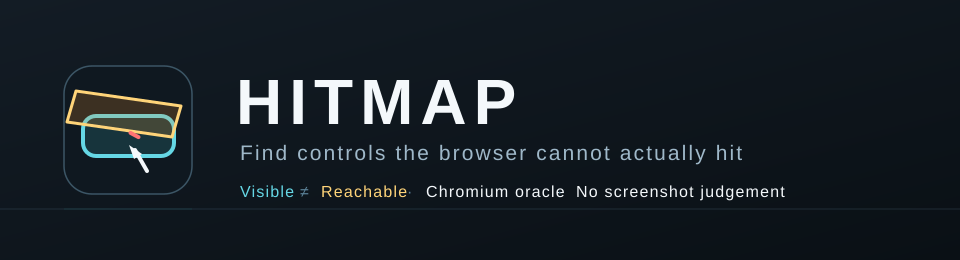

<div align="center">



<br>

**A visible control is not usable if the browser cannot route a pointer to it.**

[](TEST_REPORT.md)
[](TEST_REPORT.md)
[](#requirements)
[](#what-the-browser-decides)
[](../../../LICENSE)

[**Install**](#install) · [**Use**](#use) · [**Mechanism**](#mechanism) · [**Limits**](#limits) · [**Frozen protocol**](FROZEN_PROTOCOL.md) · [**Evidence**](RESEARCH.md)

</div>

---

## What it is

HITMAP scans one rendered browser state and asks a mechanical question for every
visible, enabled interactive target it can discover:

> **Does any sampled interior point actually hit this target, one of its descendants, or its associated label?**

The answer comes from Chromium's rendered document and hit-test stack, not from a
language model and not from a screenshot classifier.

This failure can be almost invisible in source. A fixed banner, confetti layer,
transparent overlay or stale z-index can leave a button perfectly visible while
receiving every pointer event above it. Humans normally inspect a few screenshots
and click a few controls. HITMAP evaluates the same relation across every discovered
target in the state.

## Install

HITMAP has no Python package dependency. It needs Python 3.10+ and an installed
Chromium-family browser.

```bash
cd skills/ui-ux/hitmap
./install.sh
hitmap doctor
```

Override the install prefix:

```bash
HITMAP_PREFIX="$HOME/tools" ./install.sh
```

The scanner does not download a browser. `HITMAP_BROWSER=/path/to/chromium` pins
an explicit executable.

## Use

Start the application the same way a user reaches it, then scan the exact URL:

```bash
hitmap scan http://127.0.0.1:4173/ --width 1280 --height 720
```

Machine-readable output:

```bash
hitmap scan http://127.0.0.1:4173/ --json
```

A finding looks like this:

```text
verdict   FAIL
targets   34
findings  1
  HITMAP-0018-button-aria-label-play  button[aria-label="Play"]  blocked by .secure-keys-banner
```

Exit codes in the prototype:

| Code | Meaning |
|---:|---|
| 0 | no high-confidence geometry finding in the scanned state |
| 2 | browser oracle unavailable or failed |
| 3 | at least one visible target had 0/9 reachable sample points |

A `0` is **not** a claim that the UI is correct. It means only that this detector
found no target matching its current mechanical rule.

## Mechanism

For the current top-level document, HITMAP discovers:

```text
button, input, select, textarea, a[href]
role=button|link|checkbox|radio|switch|menuitem|tab
explicit tabindex
```

It excludes disabled, `aria-disabled`, `aria-hidden`, `inert`, `display:none`,
`visibility:hidden`, fully transparent, off-viewport and sub-16 px² targets.

For each remaining rectangle it samples exactly nine points:

```text
20% ┌───────┬───────┐ 80%
    │   •   │   •   │
    │       •       │
    ├──•────•────•──┤
    │       •       │
    │   •   │   •   │
    └───────┴───────┘
```

At each point the page calls `document.elementsFromPoint(x, y)` and identifies the
first pointer-receiving element. The point is reachable only when that receiver is
the target, a descendant of the target, or an associated `<label>`.

A target becomes a geometry finding only when **all 9 sampled points are blocked**.
One reachable point is enough to suppress the finding. This deliberately favors
false negatives over noisy reports.

## What the browser decides

The browser is the external oracle for geometry. HITMAP launches Chromium with a
temporary profile, opens the URL through the Chrome DevTools Protocol, fixes the
viewport, waits for `document.readyState=complete`, then runs the hit-test probe in
the rendered page.

The Python process does not infer stacking order from CSS text. It asks the browser
what is actually at each coordinate after layout, cascade, transforms and stacking
contexts have been resolved.

The first prototype uses a small standard-library WebSocket/CDP client so there is
no Playwright, Selenium or third-party Python runtime package hidden behind the
skill.

## Why this is not a wrapper around an existing scanner

Browser automation frameworks already contain actionability checks. In Playwright,
for example, an authored click waits until the selected locator receives events.
That is useful but it presupposes a test author selected the control and attempted
that action.

HITMAP's search target is different: discover the rendered interactive surface
first, then find controls whose hit relation is impossible before an authored E2E
step exists.

It is also not an accessibility audit. WCAG conformance, keyboard behavior,
readability, visual hierarchy and design quality are outside this detector's claim.

## Limits

Version 0.1.0 is intentionally narrow:

- one browser engine: Chromium;
- one rendered state per invocation;
- top-level document only — iframes are not traversed;
- shadow-root traversal is not implemented yet;
- JavaScript-only click targets without native semantics, ARIA role or tabindex can
  be missed;
- geometry findings are not yet independently confirmed by a real dispatched click;
- an overlay with one reachable sampled pixel will not be reported;
- the scanner executes the page in a real browser. Do not scan a URL you would not
  normally open.

Those are publication blockers for a stronger claim, not footnotes. The exact
promotion gates are frozen in [FROZEN_PROTOCOL.md](FROZEN_PROTOCOL.md).

## Tests

```bash
python3 tests/run_tests.py --min 17
```

Current local result: **17/17 PASS** on Python 3.13.5. The tests cover the fixed
nine-point sampling rule, eligibility/report classification, deterministic finding
IDs and browser discovery behavior.

The historical browser-oracle evaluation is **not complete**. This execution
environment exposes Chromium 144.0.7559.96 but applies a browser policy that blocks
both local HTTP and `file:` pages, so using that environment to claim the three
historical pre/post pairs would be invalid. See [TEST_REPORT.md](TEST_REPORT.md).

## Evidence

The candidate is based on actual human-fixed failures in Storybook,
nullpoint-descent and Reframe. Exact repositories, full SHAs, parent SHAs and the
falsification rule are recorded in [RESEARCH.md](RESEARCH.md).

The thresholds were written before the historical evaluation and are frozen in
[FROZEN_PROTOCOL.md](FROZEN_PROTOCOL.md).

Apache-2.0, matching [SkillQuarry](../../../README.md).
